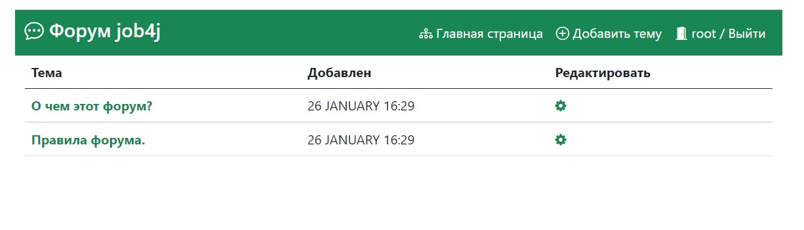
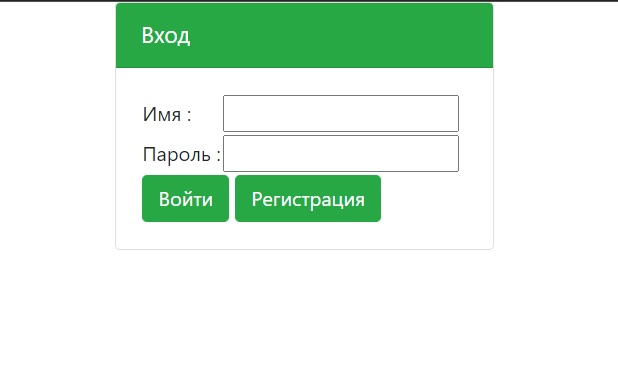
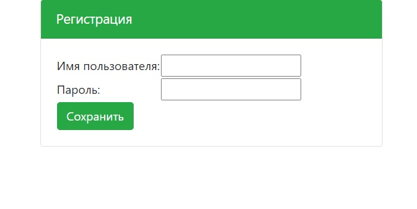
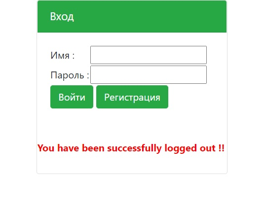
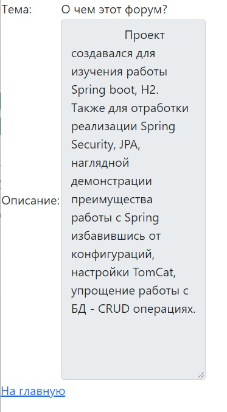

# Цель проекта
Проект создавался для изучения работы Spring boot, H2.
 Также для отработки реализации Spring Security, JPA, наглядной демонстрации 
 преимущества работы с Spring избавившись от конфигураций, настройки TomCat,
  упрощение работы с БД - CRUD операциях.
# Описание проекта
Проект представляет собой классическое приложение — форум.

Реализована возможность регистрации и авторизации, создание и редактирование темы. Данный хранятся в памяти.

Проведено тестирование методов всех контроллеров и сервисов используя фреймворк Mockito.
Frontend выполнен используя Bootstrap 5.
Проект развернут на Heroku:
https://arcane-tor-10979.herokuapp.com/login
# Запуск проекта
Проект запускается из коробки, при помощи liquibase. 
При старте приложения в БД будут загружены тестовые темы, а также пользователи, 
логин - root, пароль secret.
